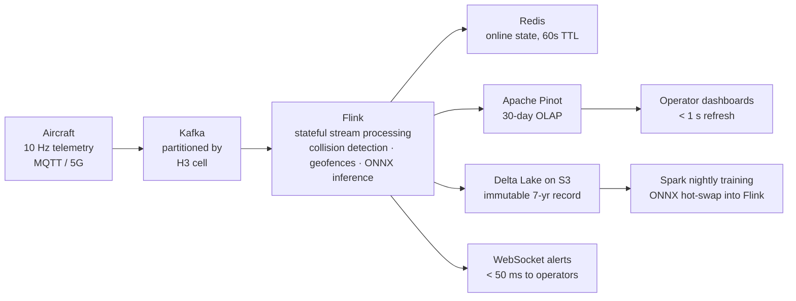

# SkyLane: A Stateful Spatial Streaming Architecture for UTM/UAM

An end-to-end data architecture for managing **100,000 concurrent autonomous aircraft**
over a single metropolitan airspace — designed to requirements derived from the
FAA UTM Concept of Operations v2.0 demand model.

> This is a design specification (graduate capstone, CISC 560 Big Data & Analytics),
> not a running system. Its value is the quantified reasoning behind every
> architectural decision. Full 25-page report in [`docs/`](docs/).

## Design Targets

| Dimension | Target |
|---|---|
| Concurrent aircraft | 100,000 |
| Telemetry ingestion | 1,000,000 events/sec (10 Hz per aircraft) |
| Collision-alert latency | p99 < 50 ms end-to-end |
| Daily data volume | 15–20 TB |
| Availability | 99.999% |
| Regulatory retention | 7 years, immutable |

## Architecture

## The Central Decision: Partition by Geometry, Not Identity

A naive collision-detection job keyed on `aircraft_id` requires every aircraft to
compare against every other — **O(n²)**, or 10¹⁰ pairwise checks per 100 ms at full
scale. Physically impossible.

SkyLane keys Kafka partitions **and** Flink state on **H3 hexagonal cells** (res 9,
~174 m edge). Every aircraft is processed alongside the only traffic it could reach
within the 3-second collision horizon — its 7-cell neighborhood. Collision detection
collapses to **O(n·k)**, k ≈ 4–8, with zero shuffle joins on the hot path.
Failure isolation comes free: a network partition degrades one geographic sector
without corrupting the rest of the airspace.

## No Free Lunches — Key Tradeoffs

| Decision | Chose | Rejected | Cost accepted |
|---|---|---|---|
| Delivery semantics | Exactly-once | At-least-once | ~2× throughput overhead; duplicated alerts ground fleets, lost alerts are unacceptable |
| Partition key | H3 cell | aircraft_id | State migration on hex crossings (~100× rarer than telemetry ticks) |
| Processing | Streaming hot path + batch cold path | Pure batch / pure streaming | Operational complexity; 50 ms SLA forces it |
| State backend | RocksDB + incremental checkpoints | Pure in-memory | ~5 ms tail latency; heap can't hold surge state |
| Storage | Delta Lakehouse (self-managed) | Snowflake | More engineering; ~10× cheaper at 6 PB/yr, open formats for regulators |
| Multi-region | Active-active | Active-passive | 2× infra cost; aviation safety demands zero RPO |

## Known Limitations

- Flink JobManager is a coordination ceiling (~10K task slots); continent scale requires federation
- H3 is a 2D index; full 4D (lat/lon/altitude/time) indexing is open research
- Assumes reliable 5G uplink; real deployments need store-and-forward at the aircraft

## Related Repositories

- [SkyLane-UTM-Geofencing](https://github.com/saaddkh/SkyLane-UTM-Geofencing) — Monte Carlo simulation of the per-cell deconfliction layer
- [OPSSAT-Hybrid-FDIR](https://github.com/saaddkh/OPSSAT-Hybrid-FDIR) — the same safety-first ML philosophy applied to ESA satellite telemetry

---
Copyright (c) 2026 Saad Dastgir 
